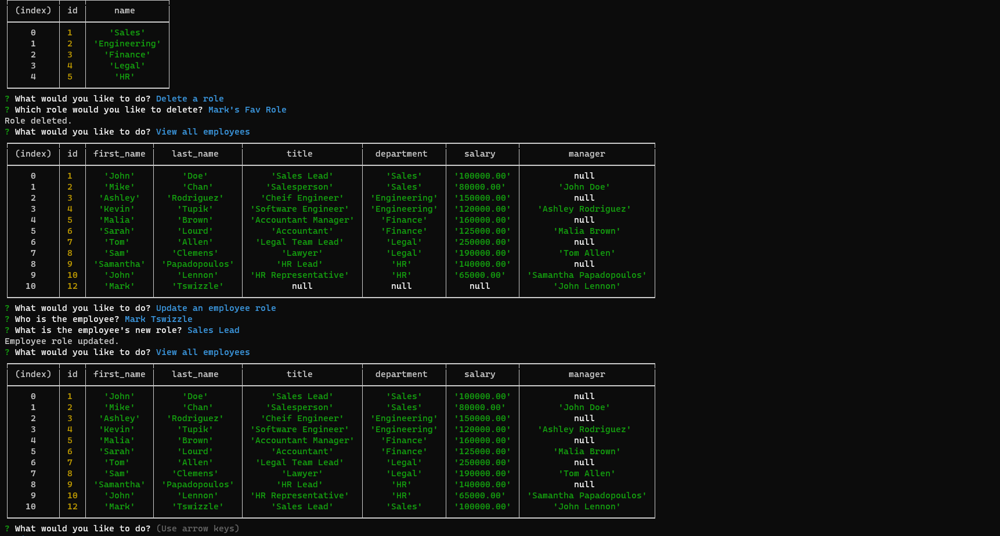

# Employee-Tracker

## Description
This application allows an employer to track and manage their different departments, employees, and job roles using an sql database

## Table of Contents (if applicable)

- [Description](#description)
- [Features](#features)
- [Installation](#installation)
- [Usage](#usage)
- [License](#license)
- [Contact Info](#contact-info)

## Features

- SQL database that is searchable and responds to different PK and FK connections
- Saves all information dynamically to the server database
- Displays information on multiple tables designed to give you complete control over your employee tracking and department management

## Installation

Please be sure to have node.js installed on your computer. Clone the repo into your folder. Make sure you have mysql2, express.js, console.table, and inquirer already installed as well by using npm install.  Open the terminal and run 'mysql -u root -p' and use the password "spamANDeggs" when prompted. Then run 'source C:\Users\ayden\Bootcamp\Employee-Tracker\db\schema.sql' to initialize the database.  If you would like some seed data to play with run 'source C:\Users\ayden\Bootcamp\Employee-Tracker\db\seeds.sql' to seed some data in to the database.  Then run 'quit' to return out of mysql to the terminal.  Lastly to run the program just type in 'npm start'

## Usage
Run the program after creating the database and/or seeding it with the provided seed data by typing into the command line 'npm start'  From here you can navigate using the arrow keys to the different options for viewing, adding, deleting, and updating the different roles, employees, and departments.

[How to use the Employee-Tracker](https://drive.google.com/file/d/1Yn7EnEMaszX_N_gvYYktzbzQ05QFOz9V/view?usp=sharing)

## License
This project is covered under the MIT [License](https://choosealicense.com/licenses/${license}).

## Contact Info

- Github: [https://github.com/markthos](https://github.com/https://github.com/markthos)
- Email: aydenthos@gmail.com
